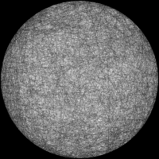
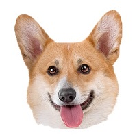
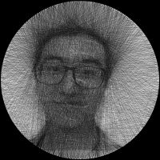

# Knitting

> Duan Gao

## Overview

- Introduction of knitting: http://artof01.com/vrellis/works/knit.html

- The algorithm is introduced by Eric Heitz: https://eheitzresearch.wordpress.com/implementation-and-realization-of-petros-vrellis-knitting/

- The main idea of this stochastic-optimization algorithm is generating random path and mutate it randomly.

## Implementation details

For every candidate path, we need to draw the path (many lines) in a canvas. 

There are two types of drawing:

- Error computation: each pixel value is the number of threads covering the pixel OR the total length of threads covering the pixel. (canvas resolution is the same as input image in error computation)

  I implement these two strategies in Image::DrawLineCount() and Image::DrawLineLength().

- Visualization (or realization): each pixel is either 1 or 0 (we can adjust the resolution of canvas to get the best visual quality, the default resolution of canvas in visualization is 4k )

## Examples 

​                                       

​	                                

> From images to GIF:
>
> $ python scripts/img2gif.py --src_path xxx --dst_path [--resolution 200]

Comparison of different gray image as guide:

| R channel                                                  | Average                                                      | Gray                                                         | Lumiance                                                     |
| ---------------------------------------------------------- | ------------------------------------------------------------ | ------------------------------------------------------------ | ------------------------------------------------------------ |
|  |  |  |  |

> gray = 0.2989 * r + 0.5870 * g + 0.1140 * b
>
> lumiance = 0.212671 * r + 0.715160 * g + 0.072169 * b

